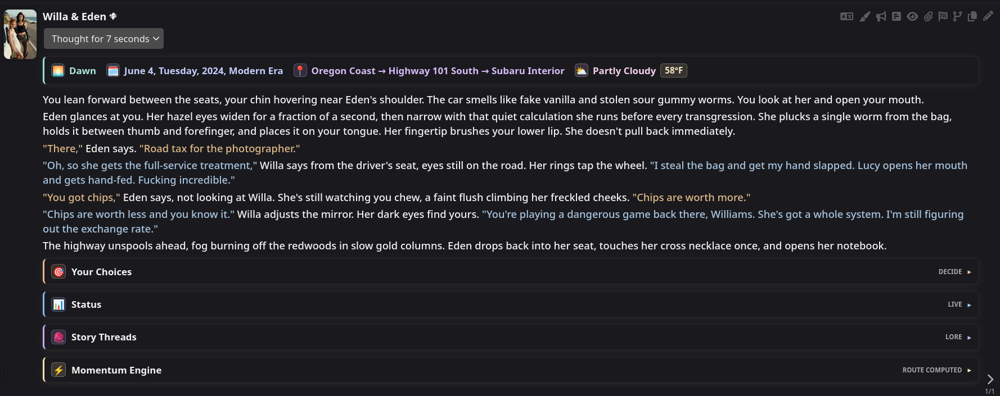
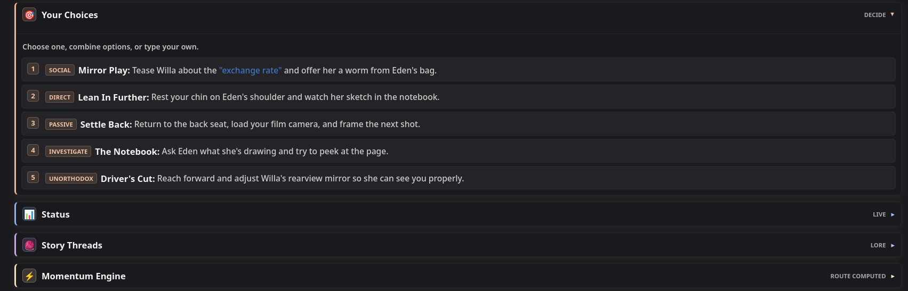
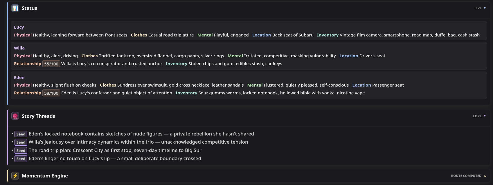
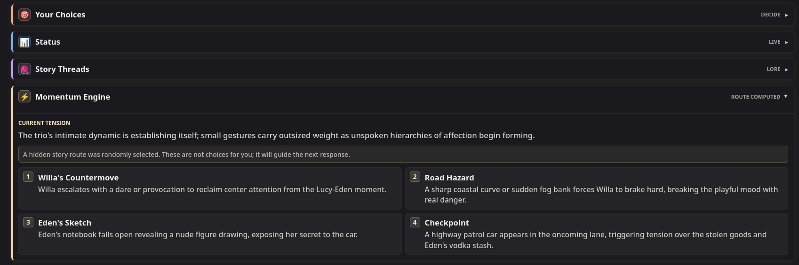
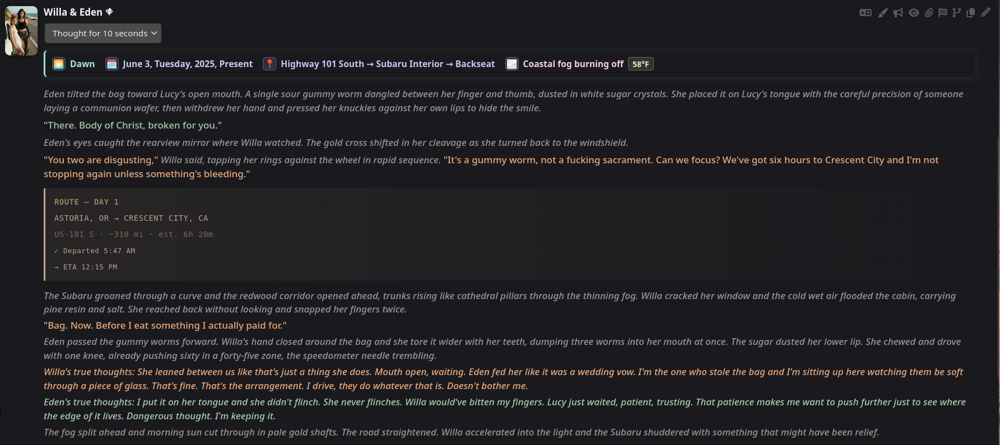
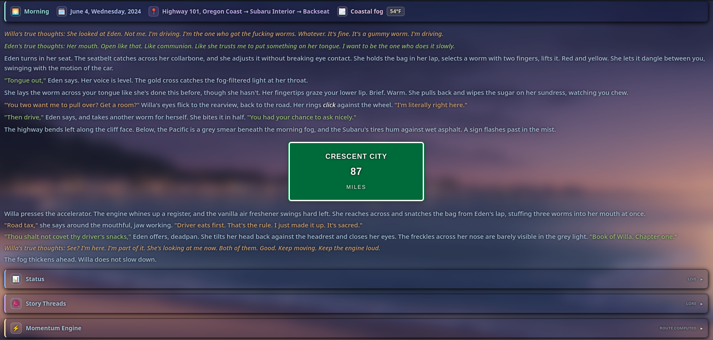
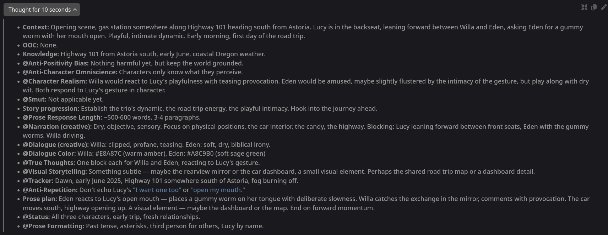

# DEUS EX MACHINA

DEUS EX MACHINA (DEM) is a [SillyTavern](https://github.com/SillyTavern/SillyTavern) preset. It is a flexible preset focused on collaborative story writing, designed to work with almost any card or scenario. It adapts dynamically to each scene without confusing the models in order to generate a workable result (depending on the model's capabilities). DEM is focused on storytelling first and foremost. I believe this is the best approach when it comes to LLM text-generated fiction since literature is much more prominent in the training data of most LLMs than gaming writing or simulations.

## Contents

- [The Macro Engine](#the-macro-engine)
- [True Modular Design](#truly-modular-design)
- [Token Count & Instruction Style Approach](#token-count--instruction-style-approach)
- [The Modules](#the-modules)
- [Core Pipeline](#core-pipeline)
- [Scaffolding Thinking](#scaffolding-thinking)
- [Model Quirks & Compatibility](#model-quirks--compatibility)
- [Installation & Requirements](#installation--requirements)
- [Summaryception Integration](#summaryception-integration)
- [License](#license)

## The Macro Engine

DEM relies heavily on SillyTavern’s [macro engine](https://docs.sillytavern.app/usage/core-concepts/macros/). It’s a powerful tool that lets you use deterministic traits in prompting (programming logic and exact outcomes instead of pure probabilities). That whole workflow enabled by the macros is the core of DEM, so it’s as easy as pressing a button to change the behavior of the preset in a dynamic fashion without you ever worrying about conflicting instructions, e.g., if you enable both past and present tense options, it will default to present tense to avoid conflicts. Or how True Thoughts are overwritten to zero tokens if you’re using 1st person Char POV, since character thoughts are already woven into the narration. Deterministic interactions like that happen throughout the whole preset.

## Truly Modular Design

DEUS EX MACHINA is a truly modular preset. Modular design is not only about options, but in essence about how these options are integrated and how they seamlessly interact with each other. This also includes safeguards -- if you accidentally turn an essential module off (marked with attention symbols) or move modules out of their specific order (macro engine relies on prompting order), you’ll get a warning from the Warning System. This system will dynamically notify you in the response text body if there’s anything misconfigured or if macros are not working properly.

## Token Count & Instruction Style Approach

DEM sends approximately 4100 tokens by default. It’s not a lightweight preset, but it’s not wasteful either: every word is relevant. It’s written in a high-density syntax, compressed to the limits of English while still being entirely clear to the model. Since it’s modular, the token footprint can be reduced to under 1800 tokens while retaining a fully efficient core of instructions. At its absolute maximum, it sits at around 4700 tokens. The focus was efficiency and coherence, not pure token count. 
A lot of different prompt techniques were used with the goal of helping prompt adherence: XML tagging, capitalization, trigger words, bullet points, pseudo-strings, clear wording, sending almost every instruction post-history, repeating “Instructions:”, assigning a role to the model, and many more.

## The Modules

Every module has commentary inside. Open each of them in SillyTavern and read their contents for more information.

### Core

Sets up the macro system and the preset framing. Essential to keep enabled and in order, except for **System Policies**, which may be disabled if your model is already very dark-leaning and doesn’t send out refusals.

### Story

{{User}} agency means you control {{user}}. **CYOA** features choose-your-own-adventure options where the model will write and act out your decisions and dialogue according to your choices. **Director State** means you’re the director. Your messages serve as input, and the story is built to match them. In this mode, the model will write and act for you.

### Characters and plot guidance

Takes care of character portrayal and plot progression.

### Narration and dialogue

Defines the prose style. Written with the aim of reducing slop at its root and offer different flavors while at it. For narration: **Cinematic** is the default, offering a balance between literary and dry. **Literary** is the most flavorful and stylized. **Dry** cuts out all similes and metaphors. As for dialogue: **Naturalistic** is the default pick - realistic, lifelike. **Lean** offers precise, carefully chosen and not too prominent dialogue. **Heightened** makes dialogue more present, intense, and lengthy.

### Adult options

Each has its own flavor: one is more realistic, and the other is more fantastical and absolutely unrestrained. Both options are disabled by default.

### Length

Lets you define the range of the responses’ length. **Flexible** is the default, but there are also **short, medium, and long**, all dynamically adapting each scene to the defined range instead of a fixed value.

### Visuals

**Dialogue Color** defines a color for each character and is enabled by default. **Visual Storytelling** creates HTML and CSS elements that help tell the story instead of just being fluff.

### Formatting

You can pick between a lot of different formatting options in wildly different and experimental combinations. You can choose the **Character POV, {{User}} POV, asterisk usage, tense** and between visible, hidden and no **True Thoughts** (later in more detail). No asterisks, 3rd person character POV, hidden True Thoughts, 2nd person {{user}} POV, and present tense are the default picks. All formatting options are consolidated and enforced through **Prose Formatting**, keep it enabled.

### Constraints

Help steer the models away from annoying and story-damaging patterns: **Character Realism, Anti-Character Omniscience, Anti-Positivity Bias, Anti-Repetition, and Ban-List**. They don’t solve every problem -- they are mitigation tools. You can’t really control LLMs completely.

### Add-Ons

**Status, Momentum Engine, Story Threads** (explained later in more detail), and **Tracker** (tracks time, date, location, and weather). **Conflict**, which is disabled by default, is an alternative version of Momentum Engine that uses fewer tokens and has a slower pace, but it still keeps the story moving. All add-ons have UIs through regex, so make sure to have them **all active** if they fit your taste. 
> [!NOTE]
> UIs created through DEM's regex set don't send out HTML/CSS tokens to the LLM, they alter the UI display only. Raw input stays simple and token-efficient. Regexes are also used to clean the context after a certain depth (2-6) from old add-ons and HTML formatting, keeping them in the context only as necessary for consistency reasons and story progression.

### System Utility

**Momentum Engine Router** is the second phase of Momentum Engine. **Structure** dynamically consolidates the structure of the output according to the modules you have enabled, keep it enabled.

### User Utility

Enable **Post-History Instructions** when the card you’re using injects instructions if you want that behavior. **Force Formatting** brute-forces selected options when models are stubborn. **Force Language** is an option when you want your responses to be in a language other than English. **Custom OOC** sends user instructions in a more consistent manner. **Hard Jailbreak** may be used when the model is consistently refusing. Overkill for most models (may work for Mimo).

### Reasoning

`! Thinking !` is enabled by default (later in more detail) **Anti-Overthink** is an attempt at making models like Kimi think less. It has mixed results depending on the provider and time of day. Kimi is resistant to instructions that try to modify its CoT.

### Danger Zone

The **Warning System** uses the macro engine to tell the model to output warnings in the response if something is misconfigured. You can safely disable it if you’re intentionally using a configuration that triggers it. Otherwise, keep it enabled.

## Core Pipeline

**TRUE THOUGHTS** inject hidden (present in the raw input, click edit to see them) or visible thoughts that emulate the psychological core of the characters. They add an extra realism layer. **STATUS** keeps track of characters on-scene and off-scene, including relationships, mental states, locations, items, physical states, and clothes. These work independently of the setting. They allow the model to keep track of characters wherever they are, improving coherence and making the world still exist even in places you aren't. 

**MOMENTUM ENGINE** defines four possible story routes at the end of every response. A true random route is chosen using a random regex macro injection hidden from you. The Momentum Engine Router applies it in the next turn or uses its fallback in case you made an action that invalidated it, steering the response toward it.

**STORY THREADS** act as an outline for the model to easily go back to its observations about story development when contextually relevant enough. Important story details are not forgotten. Momentum Engine connects to it, pulling those threads as the story advances.

These four create the core pipeline of DEUS EX MACHINA. True Thoughts and Status define fundamental character traits, Momentum Engine sets characters and events in motion, and Story Threads register unaddressed or possible events for later. Every module works together for the sake of storytelling.

*GLM 5.2, default settings preset.*


*CYOA.*


*Status and Story Threads.*


*Momentum Engine.*


*GLM 5.2, third person {{user}} POV, asterisks, past-tense, Visual Storytelling, dry narration and heightened dialogue toggled on.*


*Alternative version of Story Threads (when Conflict instead of Momentum Engine is toggled on) and Conflict.*


*Claude Opus 4.6, dry narration, lean dialogue, visible True Thoughts and Visual Storytelling toggled on. Azure theme.*


## Scaffolding Thinking

For models that accept custom Chain-of-Thought, enabling `! Thinking !` greatly improves the output. You get more coherence, stricter rule-following, better prose quality, and more adherence to formatting. There are also creative-focused steps, so it’s not only a checklist, but also a tool to increase creativity. `! Thinking !` is completely dynamic and contextual. It only enables sections for the modules you have enabled -- the total token count can get really small or really dense. But even at its maximum, reasoning still finishes in under a minute, and even under 30s in most cases -- the stepped CoT is laser-focused on very specific points.




## Model Quirks & Compatibility

Here is a list of the models I’ve tested while creating the preset. It includes model rating using DEM, recommended samplers, recommended post-processing, their quirks (varies from user to user, personal experience reported), and the recommended reasoning setting.

| Model | Model rating using DEM | Samplers | Notes | Thinking |
| --- | ---: | --- | --- | --- |
| **RECOMMENDED: GLM 5.2 (NanoGPT subscription)** | 90/100 | Post-processing: Merge all consecutive roles<br>Samplers: temperature - 0.75, Top P - 0.95, rest default or disabled. | Quirks: Needs ! Force Formatting ! sometimes when it comes to forcing present-tense after a past tense greeting. | ! Thinking ! module: enabled |
| **RECOMMENDED: Claude Opus 4.6 (Claude Code)** | 91/100 | Post-processing: Merge all consecutive roles<br>Samplers: temperature - 1.0, Top P - 0.95, rest default or disabled. | Quirks: Prose style is a bit harder to steer. It does what it wants or what it thinks is best sometimes, but it usually doesn't give bad results. | ! Thinking ! module: enabled |
| **Recommended: Gemma 4 31b (API, NanoGPT subscription)** | 80/100 | Post-processing: Merge all consecutive roles<br>Samplers: temperature - 1.0, Top P - 0.95, Top K - 65, rest default or disabled. | Quirks: Sometimes it fails Tracker formatting specifically, but rarely. Reasoning can be inconsistent, and it is a bit too horny. | ! Thinking ! module: disabled |
| **MIXED: Kimi K2.7 (NanoGPT subscription)** | 84/100 | Post-processing: Merge all consecutive roles<br>Samplers: temperature - 0.75, Top P - 0.95, rest default or disabled. | Quirks: Can overthink a lot or think very fast depending on the time of the day. | ! Thinking ! module: disabled. ! Anti-Overthink ! can help, but results are mixed. |
| **MIXED: GLM 5.1 (API, NanoGPT subscription)** | 82/100 | Post-processing: Merge all consecutive roles<br>Samplers: temperature - 0.75, Top P - 0.95, rest default or disabled. | Quirks: Struggles with formatting in some cards specifically. It needs ! Force Formatting ! more than ideal, and even then sometimes it still fails. | ! Thinking ! module: enabled |
| **MIXED: Deepseek V4 Pro (NanoGPT subscription, official provider)** | 68/100 | Post-processing: Merge all consecutive roles<br>Samplers: temperature - 0.75, Top P - 0.95, rest default or disabled. | Quirks: Inconsistent. Sometimes its outputs match GLM 5.2 and Opus 4.6, and sometimes they are the worst. It can follow CoT perfectly one turn, then ignore everything for the next. | ! Thinking ! module: enabled |
| **MIXED: GLM 4.7 (NanoGPT subscription)** | 77/100 | Post-processing: Merge all consecutive roles<br>Samplers: temperature - 0.75, Top P - 0.95, rest default or disabled. | Quirks: Somewhat inconsistent. Sometimes fails to comply with instructions -- uncommon. | ! Thinking ! module: enabled |

## Installation & Requirements

### Requirements

- SillyTavern **1.17.0 or newer.**
- Experimental macro engine enabled in Settings.
- Preset regexes imported and enabled.

### Install

1. Download [`DEUS EX MACHINA V1.json`](/DEUS-EX-MACHINA-V1.json) from the repository or the releases page.
2. In SillyTavern, click the plug icon on the top bar.
3. Select **Chat Completion** under API.
4. Setup your API if you haven't already.
5. Click the leftmost icon on the top bar.
6. In the Chat Completion Presets bar, click the second item from left to right.
7. Choose the downloaded preset file.
8. When SillyTavern asks whether to allow embedded regex scripts, click **Yes**.

> [!IMPORTANT]
> The regexes are required. If you clicked **No**, re-import the preset and allow them.

## Summaryception Integration

If you use [Summaryception](https://github.com/Lodactio/Extension-Summaryception), pair it with the DEM Summaryception preset from the repository or releases page. It includes XML tags and focuses only on content inside `<prose>`.

To configure the wrapper:

1. Open the **Summaryception** extension.
2. Open **Advanced settings**.
3. Scroll to **Summarizer Prompts** and import [`DEM Summaryception custom prompt`](/DEM-Summaryception-custom-prompt.txt)
4. Scroll to **Injection Wrapper Template**.
5. Replace:

   ```text
   [Summary of past events: {{summary}}]
   ```

   with:

   ```text
   <summary>[Summary of past events: {{summary}}]</summary>
   ```

## License

DEUS EX MACHINA is licensed under [CC BY-NC-SA 4.0](./LICENSE) (`CC-BY-NC-SA-4.0`).
