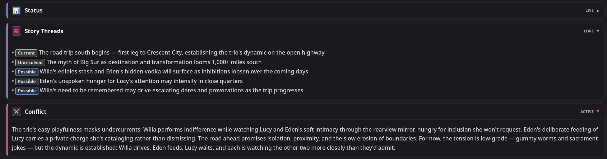

# DEUS EX MACHINA V2

DEUS EX MACHINA (DEM) is a [SillyTavern](https://github.com/SillyTavern/SillyTavern) preset. It is a flexible preset focused on collaborative story writing, designed to work with almost any card or scenario. It adapts dynamically to each scene without confusing the models in order to generate a workable result (depending on the model's capabilities). DEM is focused on storytelling first and foremost. I believe this is the best approach when it comes to LLM text-generated fiction since literature is much more prominent in the training data of most LLMs than gaming writing or simulations.

## Contents

- [The Macro Engine](#the-macro-engine)
- [True Modular Design](#truly-modular-design)
- [Token Count & Instruction Style Approach](#token-count--instruction-style-approach)
- [The Modules](#the-modules)
- [Core Pipeline](#core-pipeline)
- [⚠️ Model Setup ⚠️](#model-setup)
- [Installation & Requirements](#installation--requirements)
- [Summaryception Integration](#summaryception-integration)
- [License](#license)

## The Macro Engine

DEM relies heavily on SillyTavern’s [macro engine](https://docs.sillytavern.app/usage/core-concepts/macros/). It’s a powerful tool that lets you use deterministic traits in prompting (programming logic and exact outcomes instead of pure probabilities). That whole workflow enabled by the macros is the core of DEM, so it’s as easy as pressing a button to change the behavior of the preset in a dynamic fashion without you ever worrying about conflicting instructions, e.g., if you enable both past and present tense options, it will default to present tense to avoid conflicts. Or how True Thoughts are overwritten to zero tokens if you’re using 1st person Char POV, since character thoughts are already woven into the narration. Deterministic interactions like that happen throughout the whole preset.

## Truly Modular Design

DEUS EX MACHINA is a truly modular preset. Modular design is not only about options, but in essence about how these options are integrated and how they seamlessly interact with each other. This also includes safeguards -- if you accidentally turn an essential module off (marked with attention symbols) or move modules out of their specific order (macro engine relies on prompting order), you’ll get a warning from the Warning System. This system will dynamically notify you in the response text body if there’s anything misconfigured or if macros are not working properly.

## Token Count & Instruction Style Approach

DEM sends approximately 4100 tokens by default. It’s not a lightweight preset, but it’s not wasteful either: every word is relevant. It’s written in a high-density syntax, compressed to the limits of English while still being entirely clear to the model. Since it’s modular, the token footprint can be reduced to under 1800 tokens while retaining a fully efficient core of instructions. The focus is efficiency and coherence, not pure token count. 
A lot of different prompt techniques were used with the goal of helping prompt adherence: XML tagging, capitalization, trigger words, bullet points, pseudo-strings, clear wording, sending almost every instruction post-history, assigning a role to the model, and many more.

# The Modules

Every module has commentary inside. Open each of them in SillyTavern and read their contents for more information.

## Scene Plan -- A Different Way of Reasoning

Native Thinking can be extremely useful -- the model can plan its response and correct mistakes or wrong assumptions about the scene. However, it comes with a few problems: some models tend to overthink for thousands of tokens, doubting the prompt; other models don't overthink, but they don't follow CoT instructions, and their own reasoning is insufficient for what the scene needs, sometimes producing unnecessary drafts. 

That's why Scene Plan was created: to solve all of these issues. Scene Plan is a reasoning-like block created to plan the scene inside the final response itself, outside of the thinking block. It solves overthinking, drafting, and incomplete thinking problems entirely. Scene Plan is a dynamic-state block, so it only reasons about the modules you have enabled. 

> [!IMPORTANT]
> For most models, you have to disable native thinking/reasoning capabilities. For models where you can't disable thinking (Kimi K3, GPT 5.6, Gemini 3.1 Pro/3.5 Flash+, etc.), you have to lower the reasoning effort to the minimum possible, but still keep Scene Plan enabled. For GLM 5.3, you have to select `! Thinking ! (FALLBACK)` instead of Scene Plan in the REASONING section.

## Core

Sets up the macro cleaner and the preset framing. Essential to keep enabled and in order, except for **System Policies**, which may be disabled if your model is already very dark-leaning and doesn’t send out refusals.

## Story

You control {{User}} means you have the agency. **CYOA** features choose-your-own-adventure options where the model will write and act out your decisions and dialogue according to your choices. **Director State** means you’re the director. Your messages serve as input, and the story is built to match them. In this mode, the model will write and act for you. **Input Improver:** An AGENCY option: the model intentionally repeats your messages to improve the writing and dialogue while preserving your original intention at the same time. It doesn't write for you during the whole turn (Director does that) -- just for the first paragraph. You still control your actions.

### Characters and Plot Guidance

Takes care of character portrayal and plot progression.

### Narration and Dialogue

Defines the prose style. Written with the aim of reducing slop at its root and offer different flavors while at it. For narration: **Cinematic** is the default, offering a balance between literary and dry. **Literary** is the most flavorful and stylized. **Dry** cuts out all similes and metaphors. As for dialogue: **Naturalistic** is the default pick - realistic, lifelike. **Lean** offers precise, carefully chosen and not too prominent dialogue. **Heightened** makes dialogue more present, intense, and lengthy.

### Pacing

You can change pacing through the prompt list. There are three options:
- **Adaptive (default)** -- progression speed adapts to the card and the story. 
- **Frenetic** -- story progression is fast-paced.
- **Laid-Back** -- story progresses slowly.

### Length

Lets you define the range of the responses’ length. **Flexible** is the default, but there are also **short, medium, and long**, all dynamically adapting each scene to the defined range instead of a fixed value.

### Adult Options

There are three options. Each has its own flavor: Realistic Smut is more realistic, and Max Lewdness is more fantastical and absolutely unrestrained and uncensored in all regards. There's also a third option if you don't want NSFW: Nothing Explicit. All options are disabled by default.

### World-Building

A optional module: you can control how expansive or contained you want world-building to be. It also works with slice-of-life and real-world scenarios. There are three options:
- **Card-Default**: no tokens or instructions, only a reminder that it's following the card.
- **Contained**: only necessary additions, sheet-faithful.
- **Expanded**: detailed world-building beyond the sheet.

### Combat Writing

An optional combat prompt, and you can control how long battles last. There are three options:
- **Dynamic**: adapts length contextually to the battle.
- **Rapid**: ends fights quickly.
- **Extended**: sustains the battle for several turns.

## Narrative Styles

Narrative Styles change the atmosphere, feel, or vibes of the narrative. It won't override the card, characters, or story -- only the framing changes. There are nine options, and you can pick multiple at once: Comedic, Dramatic, Epic, Gothic, Dreamy, Surrealist, Eerie, Grimdark, and Lighthearted. When you toggle on Comedic and Dramatic, it activates the "Dramedy" prompt; Grimdark and Lighthearted activate the "Grimbright" prompt.   

## Visuals

**Dialogue Color** defines a color for each character and is enabled by default. **Visual Storytelling** creates HTML and CSS elements that help tell the story instead of just being fluff.

## Formatting

You can pick between a lot of different formatting options in wildly different and experimental combinations. You can choose the **Character POV, {{User}} POV, asterisk usage, tense** and between visible, hidden and no **True Thoughts** (later in more detail). No asterisks, 3rd person character POV, hidden True Thoughts, 2nd person {{user}} POV, and present tense are the default picks. All formatting options are consolidated and enforced through **Response Directives**, keep it enabled.

## Constraints

Help steer the models away from annoying and story-damaging patterns: **Character Realism, Anti-Character Omniscience, Anti-Positivity Bias, Anti-Repetition, and Ban-List**. They don’t solve every problem -- they are mitigation tools. You can’t really control LLMs completely.

## Add-Ons

**Status, Momentum Engine, Story Threads** (explained later in more detail), and **Tracker** (tracks time, date, location, and weather). **Conflict**, which is disabled by default, is an alternative version of Momentum Engine that uses fewer tokens and has a slower pace, but it still keeps the story moving. All add-ons have UIs through regex, so make sure to have them **all active** if they fit your taste. 
> [!NOTE]
> UIs created through DEM's regex set don't send out HTML/CSS tokens to the LLM, they alter the UI display only. Raw input stays simple and token-efficient. Regexes are also used to clean the context after a certain depth (2-6) from old add-ons and HTML formatting, keeping them in the context only as necessary for consistency reasons and story progression.

### Psychological States

Adds inner-state (internal conflict, perceptions, mind state) and motivation (immediate goal, purpose, action or inaction) fields to each major character.

## System Utility

**Momentum Engine Router** is the second phase of Momentum Engine. **Response Directives** dynamically consolidates the formatting and the structure of the output according to the modules you have enabled, keep it enabled. Enable **Post-History Instructions** when the card you’re using injects instructions if you want that behavior. 

## User Utility

**Force Formatting** brute-forces selected options when models are stubborn. **Change Language** is an option when you want your responses to be in a language other than English. **Custom Instructions** sends user instructions in a more consistent manner. **Hard Jailbreak** may be used when the model is consistently refusing. Overkill for most models (may work for Mimo). **Fandom**: if you're roleplaying in a specific series setting; helps with lore consistency, character faithfulness and coherent developments.

## Danger Zone

The **Warning System** uses the macro engine to tell the model to output warnings in the response if something is misconfigured. You can safely disable it if you’re intentionally using a configuration that triggers it. Otherwise, keep it enabled.

## Core Pipeline

**TRUE THOUGHTS** inject hidden (present in the raw input, click edit to see them) or visible thoughts that emulate the psychological core of the characters. They add an extra realism layer. **STATUS** keeps track of characters on-scene and off-scene, including relationships, mental states, locations, items, physical states, and clothes. These work independently of the setting. They allow the model to keep track of characters wherever they are, improving coherence and making the world still exist even in places you aren't. 

**MOMENTUM ENGINE** defines four possible story routes at the end of every response. A true random route is chosen using a random regex macro injection hidden from you. The Momentum Engine Router applies it in the next turn or uses its fallback in case you made an action that invalidated it, steering the response toward it.

**STORY THREADS** act as an outline for the model to easily go back to its observations about story development when contextually relevant enough. Important story details are not forgotten. Momentum Engine connects to it, pulling those threads as the story advances.

These four create the core pipeline of DEUS EX MACHINA. True Thoughts and Status define fundamental character traits, Momentum Engine sets characters and events in motion, and Story Threads register unaddressed or possible events for later. Every module works together for the sake of storytelling.

## Screenshots

*DeepSeek V4 Pro 0813, CYOA, Visual Storytelling toggled on.*


*CYOA.*


*Status*


*Story Threads and Psychological States*


*Momentum Engine.*


*Alternative version of Story Threads (when Conflict instead of Momentum Engine is toggled on) and Conflict.*


## Model Setup

> [!IMPORTANT]
**The default settings of this preset *REQUIRE* reasoning to be either disabled or set to the lowest effort possible! Exceptions: GLM 5.3.**

Recommended models for this preset: Opus 4.6 (smartest; expensive; detailed prose); Gemini 3.7 Flash (smart; cheap; realistic characters); GLM 5.2 (smart; cheap; natural dialogue); DeepSeek V4 Pro 0813 (smart; cheap; balanced qualities); Gemma 4 31b (not very smart, but follows instructions really well; very cheap).
### Most models (that support disabling reasoning): Claude Opus 4.6, Kimi K2.5/2.6, Mimo V2.5 Pro, DeepSeek V4 Pro, DeepSeek V3.2, GLM 4.7, Gemma 4 31b, etc.

- Samplers: temperature - 0.75-1.0 (Exceptions: Gemma 4 1.0, Opus 1.0. For the rest, start with 0.75, the default); Top P - 0.95 (default); rest - 1.0 or disabled (default; exceptions: Gemma 4 31b - Top K: 65)
- Post-processing: semi-strict 
- Request model reasoning: off / not checked 
- Reasoning effort: minimum 
- Scene Plan: toggled on

**Provider-specific settings:**
If on **NanoGPT** - choose a non-thinking variant of the model, e.g., DeepSeek V4 Pro 0813 instead of DeepSeek V4 Pro 0813 Thinking
If on **OpenRouter** - if "request model reasoning" is not checked (it is not by default), reasoning will be disabled if the model supports it
If on another API provider: leave "request model reasoning" unchecked and set reasoning effort to minimum. If the model still reasons (even though non-reasoning is supported by that model), try going into Connection Profile settings (plug icon) -> scroll down to "Additional Parameters", on the same line as "cancel" and "connect" -> add: reasoning: { effort: 'none' }

**If on Tavo:**
Edit API -> Settings icon (top-right) -> Request body parameters -> add: `reasoning: { effort: 'none' }` or add: `reasoning: { effort: 'low' }` if the model has reasoning always on (see list below).
### GLM 5.2
- *Post-processing: merge consecutive roles*
- Request model reasoning: off / not checked 
- Reasoning effort: minimum 
- Scene Plan: toggled on
Provider-specific settings: the same as in the "most models" section above
### GLM 5.3 (Reasoning always on)
- Samplers: temperature - 0.75 (default); Top P - 0.95 (default); rest - 1.0 or disabled (default)
- Post-processing: merge consecutive roles
- Request model reasoning: on / checked 
- Reasoning effort: minimum 
- On the prompt list, go to the REASONING section, TOGGLE OFF ! Scene Plan ! and toggle on ! Thinking ! (FALLBACK)
### GLM 5.3 Flash (Reasoning always on)
- Samplers: temperature - 0.75 (default); Top P - 0.95 (default); rest - 1.0 or disabled (default)
- Post-processing: merge consecutive roles
- Request model reasoning: on / checked 
- Reasoning effort: low (OpenRouter); medium (NanoGPT); reasoning: { effort: 'low' } on Additional Parameters -> Include Body (other OpenAI-compatible providers)
- Scene Plan: toggled on
### Kimi K3 (Reasoning always on)
- Samplers: temperature - 1.0; Top P - 0.95 (default); rest - 1.0 or disabled (default)
- Post-processing: semi-strict
- Request model reasoning: on / checked 
- Reasoning effort: low (OpenRouter); medium (NanoGPT); reasoning: { effort: 'low' } on Additional Parameters -> Include Body (other OpenAI-compatible providers)
- Scene Plan: toggled on
### Gemini 3.1 Pro, 3.5-3.7 Flash (Reasoning always on)
- Samplers: temperature - 1.0; Top P - 0.95 (default); rest - 1.0 or disabled (default)
- Post-processing: semi-strict
- Request model reasoning: on / checked 
- Reasoning effort: low (OpenRouter); medium (NanoGPT); thinkingLevel: low on Additional Parameters -> Include Body (other OpenAI-compatible providers)
- Scene Plan: toggled on

## Installation & Requirements
## Silly Tavern
### Requirements

- SillyTavern **1.18.0 or newer.**
- Experimental macro engine enabled in Settings.
- Preset regexes imported and enabled.

### Installation and download

1. Download [`DEUS EX MACHINA V2.2 ST.json`](</DEUS EX MACHINA V2.2 ST.json>) from the repository or the releases page.
2. In SillyTavern, click the plug icon on the top bar.
3. Select **Chat Completion** under API.
4. Setup your API if you haven't already.
5. Click the leftmost icon on the top bar.
6. In the Chat Completion Presets bar, click the second item from left to right.
7. Choose the downloaded preset file.
8. When SillyTavern asks whether to allow embedded regex scripts, click **Yes**.

> [!IMPORTANT]
> The regexes are required. If you clicked **No**, re-import the preset and allow them.

## Tavo
### Requirements:
- Latest version of Tavo recommended (supports SillyTavern-compatible presets, regex, HTML/CSS).
- API connection set up (any OpenAI-compatible or supported provider).
- Advanced Rendering enabled (required for full HTML/CSS rendering, including colored dialogue).
- Theme configured with no text transformation (so HTML/CSS colored dialogue is not stripped or altered).

### Installation and download
1. Download [`DEUS EX MACHINA V2.2 Tavo.json`](</DEUS EX MACHINA V2.2 Tavo.json>) from the repository or the releases page.
2. In Tavo, open the left sidebar (top-left icon) → **More** (bottom) → **Settings** → **Presets.**
3. Tap **Create**, then **Import Preset** and select the downloaded `DEUS.EX.MACHINA.V2.json` file → Tap on it → Set as default.
4. After import, select/enable the new preset in the current chat (right sidebar → Advanced Options → Presets.

### Enable Advanced Rendering (required for HTML/CSS colored dialogue)
1. Open the main interface.
2. Tap the top-left corner to open the left sidebar.
3. Tap **More** at the bottom.
4. Tap **Settings**.
5. Tap **Advanced Rendering**.
6. Toggle **Advanced Rendering** **ON**.

This lets the chat page render standard HTML and CSS (including colored spans, styles, etc.).

### Theme settings – no text transformation (allow HTML/CSS colored dialogue)
1. Open the left sidebar → **More** → **Themes**.
2. Select your current theme (or copy an official theme to create a custom one).
3. In the theme editor, go to Character message and disable **Tone highlight** and **Quote highlight.**
4. Save/apply the theme and make sure it is active for the chat.

Once Advanced Rendering is on and the theme has no text transformation, HTML/CSS-colored dialogue from the preset (or regex) will display properly.

## Summaryception Integration

If you use [Summaryception](https://github.com/Lodactio/Extension-Summaryception), pair it with the DEM Summaryception preset from the repository or releases page. It includes XML tags and focuses only on content inside `<prose>`.

To configure the wrapper:

1. Open the **Summaryception** extension.
2. Open **Advanced settings**.
3. Scroll to **Summarizer Prompts** and import [`DEM Summaryception custom prompt`](/DEM-Summaryception-custom-prompt.txt)
4. Scroll to **Injection Wrapper Template**.
5. Replace:

   ```text
   [Summary of past events: {{summary}}]
   ```

   with:

   ```text
   <past_events>[Summary of past events: {{summary}}]</past_events>
   ```

## License

DEUS EX MACHINA is licensed under [CC BY-NC-SA 4.0](./LICENSE) (`CC-BY-NC-SA-4.0`).
